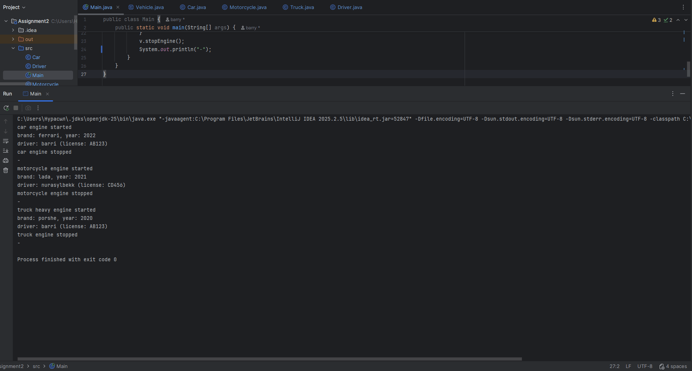

Assignment2

A.Vehicle Management System:
What is this? This project is a simple Vehicle Management System built with Java. Its main goal is to show how different objects like Cars and Trucks can share the same basics while still being unique.

B.How it is organized:
The Parent (Vehicle): This is the master plan for all vehicles. It holds the brand and year.
The Children (Car, Motorcycle, Truck): These are specific types of vehicles that inherit everything from the Parent but add their own features.
The Driver: A separate class for people. A driver can be assigned to one or many vehicles.

Key Rules I Followed:
Abstraction: I created a start engine rule that every vehicle must follow, but they each do it in their own way.
Encapsulation: I used protected and private keywords to keep the data safe and organized inside the code.
Inheritance: Instead of writing the same code over and over, the subclasses borrow the basics from the main Vehicle class.

Access Modifiers:
Protected: Used for brand and year in the Vehicle class so that subclasses can access them directly.
Private: Used for specific fields (like doors or capacity) to ensure strict encapsulation.

C.How to Run It:
Open your computer terminal.
Type this to prepare the files: 
javac *.java.
Type this to start the program:
java Main.

D.Screenshot

E.Reflection:
What I Learned Using inheritance made the code much cleaner because I did not have to repeat the brand and year for every vehicle. Method overriding was helpful because it allowed the Truck to start with a heavy engine sound while the Car starts normally. The biggest challenge was making sure the Drivers were assigned correctly to the right vehicles, but using a simple array in the Main file made it much easier to manage.
